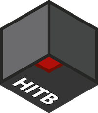

#  HITB PRO CTF 2021

PRO CTF is an onsite international challenge in information security. Developed by Hackerdom team for HITB CyberWeek in Abu Dhabi, UAE. PRO CTF 2021 was held on November 24–25, 2021.

The contest is driven by almost classic rules for Attack-Defense [CTF](https://en.wikipedia.org/wiki/Capture_the_flag#Computer_security). Each team is given a set of vulnerable services.
Organizers regularly fill services with private information — the flags.
The goal of each team is to find vulnerabilities, fix them in their services and exploit them to get flags from other teams.

This year we've prepared special version of the rules and scoring system which can be used in our next competitions: https://docs.google.com/document/d/1uU9f38UpxdsMeuAsM5TAnp_i4T-DhM-Ur9JOxUeTc8M/edit

This repository contains:

* source of all services in folder [services/](services/)
* checkers for [checksystem](https://github.com/Hackerdom/checksystem) in folder [checkers/](checkers/)
* exploits for all services in folder [sploits/](sploits/)
* writeups with vulnerabilities and exploitation description for all services in folder [writeups/](writeups/)
* source code for the jury side's service in folder [jury_services/](jury_services/).

Also, we bring to you some of our internal infrastructure magic:
* CI for Digital Ocean's images services' packing. See [vuln_images/](vuln_images/).
* our CTF Cloud Infrastructure in [ansible/roles/cloud_master](ansible/roles/cloud_master).
* on-site router configuration in [router/](router/) — it's really simple this year.

Final scoreboard:

# First bloods

| **SERVICE**    | **TEAM**                 |
| -------------- | ------------------------ |
| fs             | Bushwhackers             |
| chess          | mhackeroni               |
| p0ck37         | Bushwhackers             |
| forvolution    | RedRocket                |
| timecapsule    | organizers               |
| genealogy      | C4T BuT S4D              |
| cells          | perfect blue             |
| authme         | Nupakachi                |
| caas           | C4T BuT S4D              |
| hsm            | Bushwhackers             |
| mp             | More Smoked Leet Chicken |

# Authors

This CTF is brought to you by these amazing guys:

* Alexander Bersenev aka `bay`, the author of services `chess` and `authme`, also our cloud and VPN master
* Andrew Gein aka `andgein`, the author of the service `genealogy` and support for teams
* Andrey Khozov aka `and`, the author of the service `caas`, also our checksystem master
* Artem Zinenko aka `art`, the author of the service `p0ck37`
* Artur Khanov aka `awengar`, the author of the service `cells`
* Bulat Zaynullin aka `tinkturianec`, the author of the service `forvolution`
* Dmitry Simonov aka `dimmo`, the author of the service `hsm`, also our on-site network master
* Dmitry Titarenko aka `dscheg`, the author of the service `timecapsule`, and our techleader
* Konstantin Plotnikov aka `kost`, the author of services `fs` and `mp`, and our teamleader

If you have any question about services write us an email to [info@hackerdom.ru](mailto:info@hackerdom.ru).

© 2021 [HackerDom](http://hackerdom.ru)
