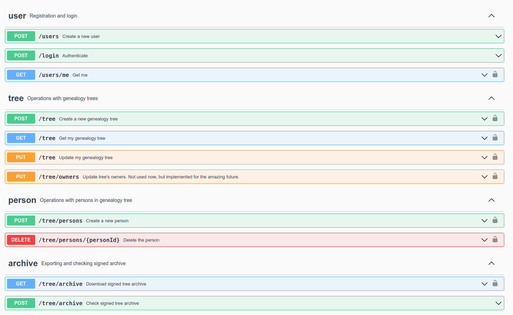

# Genealogy Tree Service aka `genealogy`

This is a simple API for storing genealogy trees. Service is written in C++, uses PostgreSQL, and communicates via JSONs. Also, it uses brotobufs — it's like protobufs but cooler! Unfortunately, some code generated by `brotoc` (the equivalent of `protoc` tool) is "lost" according to the legend and was not available during the game, but now you can see it [here](https://github.com/HITB-CyberWeek/proctf-2021/tree/main/services/genealogy/src/brotobuf).

See the full list of available endpoints below (Swagger UI has been available as a part of the service).



Two teams hacked the service during the game.

## Vulnerabilities

There were two known vulnerabilities in the service. The first one was unintended, we've found it during the game only. This vulnerability leads to secret key leaking. This secret key is used for hashing users' cookies, so the hacker can hijack cookies and make requests as a legit user.

Intended vulnerability is harder, and leads to RCE which allows, for instance, to do the same secret key leaking or its overriding.

## First vulnerability

Secret keys are generated by the following code in the service:

```(cpp)
std::string KeyStorage::_generate_key(std::string::size_type length) const {
    // Generate truly random key with desired length
    static auto& chrs = "0123456789"
        "abcdefghijklmnopqrstuvwxyz"
        "ABCDEFGHIJKLMNOPQRSTUVWXYZ";

    thread_local static std::mt19937 rg{std::random_device{}()};
    thread_local static std::uniform_int_distribution<std::string::size_type> pick(
        0, sizeof(chrs) - 2
    );

    std::string s;
    s.reserve(length);

    while (length--)
        s += chrs[pick(rg)];

    return s;    
}
```

It uses Mersenne Twister engine `std::mt19937` from the C++11 (see [https://en.cppreference.com/w/cpp/numeric/random/mersenne_twister_engine](https://en.cppreference.com/w/cpp/numeric/random/mersenne_twister_engine)) with a number from `std::random_device` as a seed.

As described at [https://en.cppreference.com/w/cpp/numeric/random/random_device/entropy](https://en.cppreference.com/w/cpp/numeric/random/random_device/entropy) `std::random_device` has an entropy equal to 32, so only 2 ^ 32 different values are possible!

So, if you register a new user, retrieve a cookie for him, and bruteforce all 2 ^ 32 different values of the seed, you can find out which seed has been used. It means you can build the same cookie key and hijack the cookie for any user id.

## Second vulnerability

As I said before, the second vulnerability is significantly harder. It is a combination of CMAC algorithm weakness and Heap Buffer Overflow.

Firstly, it's needed to describe the service functionality. You're able to register a new user and create a genealogy tree. You can also create "person" objects, which are nodes of the genealogy tree. Each person has meta information (such as a title, first name, last name, etc) and two optional links to its parents.

You can get your tree as a JSON (see `/tree` endpoint) or download it as a signed binary archive (`/tree/archive`). If you prefer the second way, you can check your archive later by sending the POST request to the same `/tree/archive` with your archive. This endpoint checks the signature, unpack the archive, and returns the JSON with the tree for you.

### Brotobuf

As I also said before, trees are just encoded to the binary archive by the `brotobuf` serializer. It's also responsible for the archive's decoding. As you didn't have the source code of the encoder and decoder during the game, you had to decompile them from the binary. Thank God, now we can read C++ sources: https://github.com/HITB-CyberWeek/proctf-2021/tree/main/services/genealogy/src/brotobuf

The encoding algorithm is really **very similar** to [Google's protobuf](https://developers.google.com/protocol-buffers). Each structure (`GenealogyTree` and `Person`) has some fields, see [messages.proto](https://github.com/HITB-CyberWeek/proctf-2021/blob/main/services/genealogy/src/messages.broto) for details (this file has been deployed with the service):

```
/*
It's brotobuf file. Brotobufs are like protobufs but much cooler!

This file has been compiled by brotoc to brotobuf/* files.
Unfortunately, .cpp files have been lost as well as brotoc compiler.
*/

message Person {
  required int64 birth_date = 0;
  required int64 death_date = 1;
  required string title = 2;
  required string first_name = 3;
  required string middle_name = 4;
  required string last_name = 5;
  required string photo_url = 6;
  repeated Person parent = 7 [max_amount = 2];
}

message GenealogyTree {
  required int64 id = 0;
  required string title = 1;
  required string description = 2;
  repeated int64 owner = 3 [max_amount = 60];
  optional Person person = 4;
}
```

Each field has a type, index, and probably some modifier (such as `optional`, `required` or `repeated`) with the possibility to specify the limit of objects for each repeated field. You may note that Google Protobufs has a similar syntax except the `max_amount` modifier (but it has another).

During the encoding, each **non-empty field** is encoded in the order they're described in the `.broto` file.
So, for the `Person` model, `birth_date` is encoded first (if it's not equal to 0), `death_date` — second, etc.
Integers are encoded as `varint` (see [original protobuf documentation](https://developers.google.com/protocol-buffers/docs/encoding) about them), strings are encoded as length written as `varint` and followed by `length` bytes. Complex fields (such as `GenealogyTree.person`) are also encoded as `varint` with the length followed by `length` bytes of the internal message.

`varint` with the field index is also prepended before each field to have a possibility to decode them correctly.

Let's see an example. The archive

```
00 01 01 07 4d 79 20 74 72 65 65 
```

is decoded to `GenealogyTree(id=1, title="My tree")`, because it's splitted as `00 01` and `01 07 4d 79 20 74 72 65 65`, where first part means "zero field is equal to 1", and second part means "first field is equal to string with length 7 and bytes \[0x4d, 0x79, 0x20, 0x74, 0x72, 0x65, 0x65\]".

Also, the decoding library has an additional feature: if you have a `BROTOBUF_DEBUG_MEMORY` environment variable and its value is equal to "1", the library will print debugging logs about memory manipulations such as allocating and freeing the memory. It can be useful further during the heap overflowing.

### Reading of the Uninitialized Memory

Okay, what about vulnerabilities?

First, there is a bug in the decoding algorithm. As you can see in [protobuf/person.cpp#L14](https://github.com/HITB-CyberWeek/proctf-2021/blob/main/services/genealogy/src/brotobuf/person.cpp#L14), only complex fields (such as strings or other models) are initialized in the constructor, but integer fields stay uninitialized. They initialize when we meet them in the encoded stream, but if the value is equal to zero, it has not been encoded at all!

So our steps should be the following: create a user, create a person with a zero `birth_date`, create a tree with this person, encode and send it back to the checking endpoint. In this case, the field of `Person.birth_date` is left uninitialized. Whem memory of the field `person` is allocated on the heap, the `birty_date` will contain the internal data from malloc chunk, because it's the first field of the structure. 

Here, if you know nothing about memory allocation at glibc, you have to read the following links:

- [MallocInternals](https://sourceware.org/glibc/wiki/MallocInternals)
- [Heap Exploitation](https://guyinatuxedo.github.io/25-heap/index.html)

The first 8 bytes in freed malloc's chunk is an address of the previous chunk, or the address of pointer in the `main_arena` if this chunk is the first chunk in the linked list in `tcache` bin. So, if we allocate the chunk again and don't initialize these bytes, the address of the `main_arena` can leak via the `birth_date` field.

Why is it useful? Thanks to the address of `main_arena` we can get the base address of libc, which will be used later.

You can see the code for this vulnerability here: [genealogy.sploit.py#L25-L53](https://github.com/HITB-CyberWeek/proctf-2021/blob/main/sploits/genealogy/genealogy.sploit.py#L25-L53).

### Buffer Overflow

Let's imagine that service has no archive signing, and we can edit the binary stream which we send to `POST /tree/archive`. In this case, the code of decoding repeated fields is vulnerable to a heap buffer overflow.

Look at this code of decoding `int64 owner = 3 [max_amount = 60]`:

```(cpp)
    case 3:
      if (this->owners.empty()) {
        this->owners.resize(60);
        if (this->_debug_memory_logs_enabled()) {
          printf("Allocated %ld bytes for owner->owners at %p\n",
                 60 * sizeof(unsigned long long), owners.data());
        }
        this->_owners_iterator = this->owners.begin();
      }
      if (this->_debug_memory_logs_enabled()) {
        printf("Deserializing data to owner->owners[%ld]\n",
               this->_owners_iterator - this->owners.begin());
      }
      *(this->_owners_iterator) = this->_deserialize_varint(stream);
      this->_owners_iterator++;
      break;
}
```

You can find it at [brotobuf/tree.cpp](https://github.com/HITB-CyberWeek/proctf-2021/blob/main/services/genealogy/src/brotobuf/tree.cpp#L65-L88).

If we find an `owner` field in our stream, and there are no owners at this moment, we resize `this->owners` to 60, which is equal to `max_amount` in brotospec. The `.resize()` method allocates memory for the internal buffer of `std::vector`. After that we set `this->_owners_iterator` to the first element of `this->owners`.

Each following owner is deserialized via `*(this->_owners_iterator) = this->_deserialize_varint(stream);`, without any checking that `this->_owners_iterator` is still inside of the `this->owners`.

So if our archive has 61 owners for the tree, we can overwrite memory not belonging to our `std::vector<unsigned long long>`. Usually, there is the next chunk of memory in this place, so we can control the internal glibc's data structure of the next chunk. Particularly, the pointer to the other chunk in the double-linked list of the `unsorted` bin.

So the owners list should be following:

`[0, 0, 0, 0, <56 more items>, 0, ADDRESS]`

And the steps should be following:

1. Allocate the first chunk.
2. Allocate the second chunk, which is located just behind the first one.
3. Allocate the third chunk.
4. Free third chunk.
5. Free the second chunk, now particularly its memory contains a pointer to the third chunk. The unsorted bin has at least two chunks (second and third) at this moment.
6. Overflow first chunk, rewrite this pointer by address X.
7. Allocate the next chunk, we should get the second one.
8. Allocate one more chunk. We should get address X for this.
9. Write any data to the latest chunk. Congratulations! You have an arbitrary write to any memory. 

How can we achieve this sequence in our decoder? Easy!

Let's create the following tree object:

1. `required int64 id = 0;` — any
2. `required string title = 1;` — long enough
3. `required string description = 2;` — empty
4. `repeated int64 owner = 3` — 60 numbers
5. `optional Person person = 4;` — complex object with some depth to allocate enough number of chunks and free it during the decoding process
    * `repeated Person parent = 7`
        * `repeated Person parent = 7`
            * `repeated Person parent = 7`
6. `repeated int64 owner = 3` — 3 more elements: `[0, 0x1c1, ADDRESS]`. `0x1c1` here is a chunk length which should remain unchanged after overflow
7. `optional Person person = 4;` — yes, again, one more `person` in our stream. Now we need it to allocate chunks sequentially and at some moment receive a chunk located at `ADDRESS`.
    * `repeated Person parent = 7`
        * `repeated Person parent = 7`
            * `required int64 birth_date = 0;` — with DATA which we want to put into `ADDRESS`


So, which `ADDRESS` and `DATA` should we use? The common practice is to use the address of libc's `__free_hook` (see [docs](https://linux.die.net/man/3/__free_hook)) and the address of `system` function. In this case every call of `free()` will lead to call a `system()` function with the same argument! And we will get a RCE!

### Cryptography

Buuuuut. We have a problem here. Our archives are signed by some sort of MAC (AES-256-CBC-MAC), and we can't just construct any binary stream we want. Also, we need to construct a valid signature for it.

If you know nothing about CBC-MAC, I suggest reading following links first:

- https://en.wikipedia.org/wiki/CBC-MAC
- https://cryptography.fandom.com/wiki/CBC-MAC

Shortly, it encodes a padded archive with AES-256 with Cipher block chaining (aka CBC) and returns the last block (16 bytes) as a signature.

This signature algorithm has some weaknesses if the message has a non-fixed length. See the following guide about that:

- https://blog.cryptographyengineering.com/2013/02/15/why-i-hate-cbc-mac/

However, our implementation has protection from it, because it appends the message length to the message before signing. At least, you can think that it works. Unfortunately, this protection is secure only **for prepending** the length, not **for appending** it:

- https://crypto.stackexchange.com/questions/11125/why-does-only-length-prepending-improve-the-security-of-cbc-mac/11152#11152

In other words, we can construct three messages `M1`, `M2`, `M3`, request to sign them, and later build the signature for another message (`M4`) which our service didn't sign. How does it work? Simple enough!

1. Choose `M1` randomly.
1. Choose `M2` randomly, but with the same length.
1. Build `M3` as `M2 + length(M2) + padding + <any random suffix>`
1. Request to sign all three messages, receive `S1` for `M1`, `S2` for `M2`, and `S3` for `M3`.
1. Congratulations! Now you know that `S3` is also the signature of `M4 = M1 + length(M1) + padding + <suffix>`, where `<suffix>` is equal to `<any random suffix>` everywhere except the first block. The first block should be xored by `S1 ^ S2` (because it's how CBC works).

### Put it all together

The end is near.

We need to construct (and sign) such three trees, which will get to us such archives `M1`, `M2` and `M3`
which satisfies statements from the previous section. Moreover, built `M4` should lead to heap buffer overflow described above.

Fortunately, there is a way to do it. You can see the code of tree generating in [genealogy.sploit.py#L90-L157](https://github.com/HITB-CyberWeek/proctf-2021/blob/main/sploits/genealogy/genealogy.sploit.py#L90-L157).

The first tree is almost empty, see its generator below. 
It will be described later why `PAYLOAD` is inserted into the `owners` list, but now this list must have length 60 (which is maximum for the `owners` list):

```(python)
PAYLOAD = b"echo -n a > ./keys/cookie.key"

def generate_first_archive(endpoint: str) -> tuple[int, bytes, bytes]:
    login = generate_random_string()
    password = generate_random_string()

    # 60 is max size of owners list
    payload = generate_payload(60)

    # 0x257 is desired total length, 173 is a total size of other fields (may change if you change PAYLOAD)
    description_length = 0x257 - 173

    with GenealogyClient(endpoint) as client:
        user_id = client.create_user(login, password)
        client.login(login, password)
        # Put enough chunks to tcache (2 will be enough)
        grandparent = client.create_person("", 1, 2, None, None)
        parent = client.create_person("", 1, 2, grandparent, None)
        root = client.create_person("", 1, 2, parent, None)
        client.create_tree("", "x" * description_length, root)

        client.update_owners(payload)

        archive_with_signature = client.download_tree_archive()

    archive, signature = extract_archive_and_signature(archive_with_signature)
    return user_id, archive, signature
```

Archive for the first genealogy tree has the following structure:

```
00 a6 01 02 aa 03 78 78 78 78 [...] 78 03 e5 c6 a1 fb 86 a4 8b b7 20 03 e1 c0 f8 81 e2 
e5 cb b5 65 03 f9 e6 bd 99 f6 ed db b5 69 03 e5 dc ac ab 96 0f 03 01 03 02 03 03 03 04 03 05 03 06 03 07 03 08 03 09 03 0a 03 0b 03 0c 03 0d 03 0e 03 0f 03 10 03 11 03 12 03 13 03 14 03 15 03 
16 03 17 03 18 03 19 03 1a 03 1b 03 1c 03 1d 03 1e 03 1f 03 20 03 21 03 22 03 23 03 24 03 25 03 26 03 27 03 28 03 29 03 2a 03 2b 03 2c 03 2d 03 2e 03 2f 03 30 03 31 03 32 03 33 03 34 03 35 03 
36 03 37 03 38 04 10 00 01 01 02 07 0a 00 01 01 02 07 04 00 01 01 02 
```

As you can see, it is flooded by the `description` field with a lot of "x" chars ("x" = `0x78`). The total length of the archive is 0x257, because it has been selected by the generator.

The second archive is even simpler: it uses the only field of the tree (`title`) and makes it an appropriate length.

```(python)
# 1 byte for id's field number,
# 3 bytes for title's field number and length (length is large enough to occupy 2 bytes)
title_length = total_length - user_id_length - 1 - 3
title = "x" * title_length

with GenealogyClient(endpoint) as client:
    client.create_user(login, password)
    client.login(login, password)
    client.create_tree(title, "")

    archive_with_signature = client.download_tree_archive()
```

Archive for this tree is the following:

```
00 a7 01 01 d1 04 78 78 78 [only 78's...]
```

The total archive's length is also 0x257.

The third archive is built from the modified second tree (let's remember that `M2` should be a prefix of `M3` ;-). Here, we set the `owners` field to some values (they will be overflowing values later, so `0x1c1` is just a chuck size in glibc, and `free_hook_address` is an address of `__free_hook` which should be interpreted by `glibc` as an address for next chunk):

```(python)
client.update_owners([0, 0x1c1, free_hook_address])
```

Also it sets `description` to the special value (see the sploit for implementation details):

```(python)
padding_length = len(length_and_padding1) - 2
description = length_and_padding1[2:].decode() + "x" * (length_and_padding1[1] - padding_length)
```

The third archive has the following structure:

```
00 a7 01 01 d1 04 78 78 78 [again a lot of 78s...] 78 
02 57
Oh my God! This 02 57 is a field index and string's length now, but look — they were here on the signing process of the previous archive because its total length is 0x257. It's amazing!

07 07 07 07 07 07 07
Oh my God again! These bytes are just description's bytes here, but for the previous archive they were 
the padding before AES-256-CBC-MAC.

78 78 78 78 [yes, just a bunch of 78s, we need them again...]
03 00 03 c1 03 03 f0 dc 88 a1 94 e1 1f 04 1c 07 
18 07 0c 00 d0 bc aa a0 94 e1 1f 07 00 07 00 07
08 00 d0 bc aa a0 94 e1 1f 07 00 
```

As you can see, `M3` satisfies all requirements, it starts with `M2`, followed by its length and the padding.

It means we can build `M4` — archive with the heap overflow (it will contain 63 = 60 + 3 elements in the `owners` list, first bunch from the `M1` and last three from `M3`):

```(python)
suffix = archive3[len(archive1) + len(length_and_padding1):]
hacked_archive = archive1 + length_and_padding1 + bytes(xor(xor(signature1, signature2), suffix))
```

When we send this archive with the valid signature (it's the same as for `M3`) to the server, we overwrite `__free_hook` to the address of the `system()`, so each next `free(object)` call will be the same as `system(address)`. But one of the following `free()` call will be invoked for the `owners` list.
And it's the reason why we've put our `PAYLOAD` to this list at the same beginning of exploit building.

Any questions? Feel free to write to [andgein@hackerdom.ru](mailto:andgein@hackerdom.ru) or read the [full exploit](https://github.com/HITB-CyberWeek/proctf-2021/blob/main/sploits/genealogy/genealogy.sploit.py)
