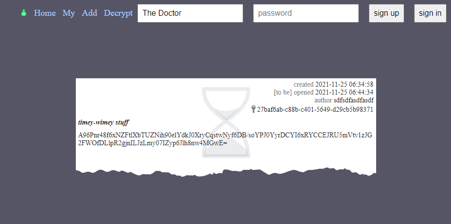
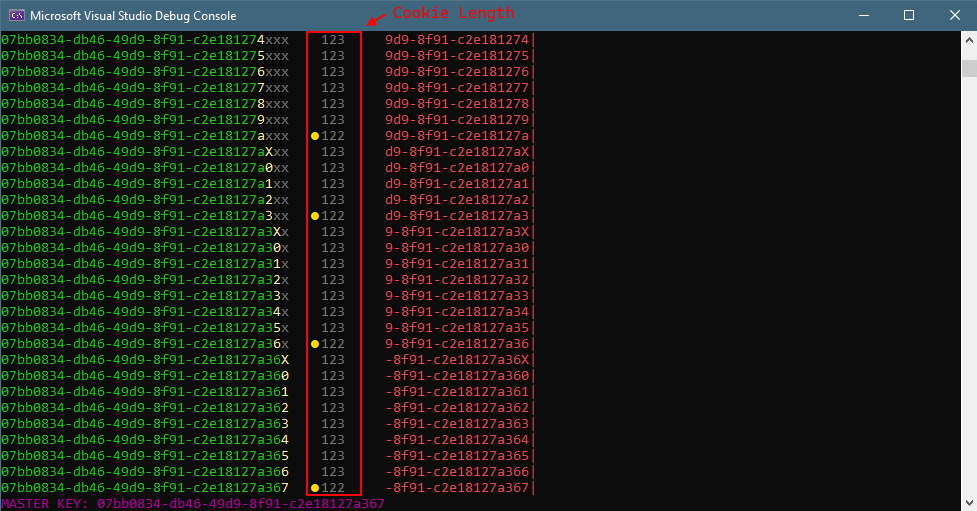

# timecapsule
**timecapsule** is a web service for posting messages to future people. Messages are encrypted and the encryption key is published only at the time specified by the author.



HTTP API:
* `GET /api/auth` — returns the current user login;
* `POST /api/signup` — sign up;
* `POST /api/signin` — sign in;
* `GET /api/capsules` — get a list of time capsules;
* `GET /api/capsule/{id}` — read capsule by id, the capsule text is encrypted, the decryption key is visible only for the author or when the capsule is expired;
* `POST /api/capsule` — add new time capsule;

Flag ID is a capsule ID, the flag is inside a capsule text.

## vuln
The first problem is `TimeCapsuleWrapper` class is used for serialization and encryption of both capsule with a flag and an authentication cookie.
Before the encryption, compression is applied, that's why the service is vulnerable to [CRIME](https://en.wikipedia.org/wiki/CRIME) (Compression Ratio Info-leak Made Easy) attack.
It allows an attacker to perform a sequential per-byte brute-force to guess some unknown content of the cookie by manipulating the known text, because the repeating parts of plaintext are replaced by references, reducing the total compressed-then-encrypted length.

The second problem is the messy usage of `ToLower` method to implement case insensitivity. In particular, one of the usages is in the [cookie serialization method](../../services/timecapsule/src/TimeCapsuleWrapper.cs#L130).
The key point is that the byte length of the original message and the byte length of the message after `ToLower` may be different when using some unicode characters.

```cs
private static int Write(Span<byte> span, string value)
{
    var len = Encoding.UTF8.GetByteCount(value ??= string.Empty);
    if(len > 255) throw new ArgumentException("Value too long", nameof(value));
    span[0] = (byte)Encoding.UTF8.GetBytes(value.ToLower(), span.Slice(1, len));
    return 1 + len;    /* len may be greater than the saved length in span[0]
                        * this increases the total length used in the buffer
                        * while the buffer space is not overwritten */
}
```

In this case, we are interested in characters that reduce the length of the byte string after lowercasing. For example `Kelvin Sign (U+212A)` (3 bytes length UTF-8) after lowercasing with `ToLower` becomes simple `Latin Small Letter K (U+006B)` (1-byte length UTF-8).
This changes the length of the cookie buffer, it becomes larger than the actual written content length, so the subsequent compression and encryption stages use slightly more data from the buffer, which is not overwritten by the serialization.
And then reuse of buffers opens a possibility of capturing the master encryption key in the tail of the buffer, which is there after the previous reading of the [configuration file](../../services/timecapsule/src/TimeCapsuleWrapper.cs#L21).
All of this allows `CRIME` to be used to brute force the master key. After that, you can use the key to generate the cookie. Logging into the account of the specified author, you can see all the encryption keys for messages.

Also writing an exploit requires some minimal knowledge of the [LZ4 block format](https://github.com/lz4/lz4/blob/dev/doc/lz4_Block_format.md) used for compression.
Important notes here are:
* the minimum length of a match is 4;
* with matchlength greater than 18 an additional byte is used for storing the length of the match.

## exploit


See full exploit here:
https://github.com/HITB-CyberWeek/proctf-2021/blob/main/sploits/timecapsule/src/Program.cs
